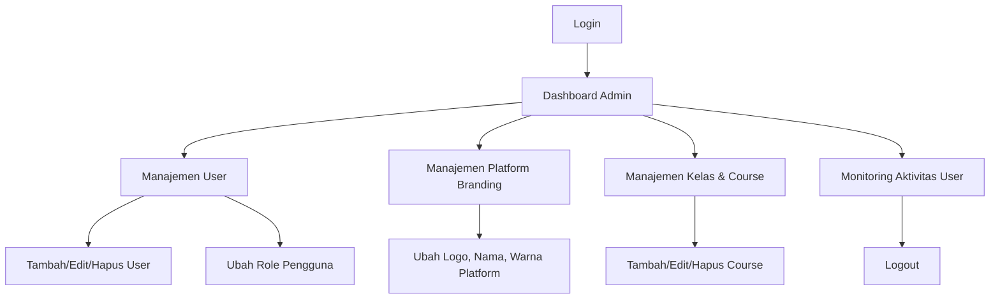
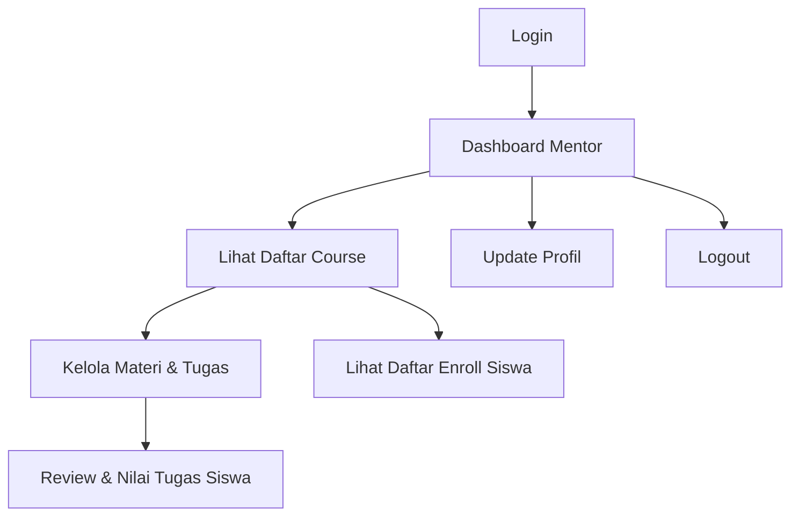
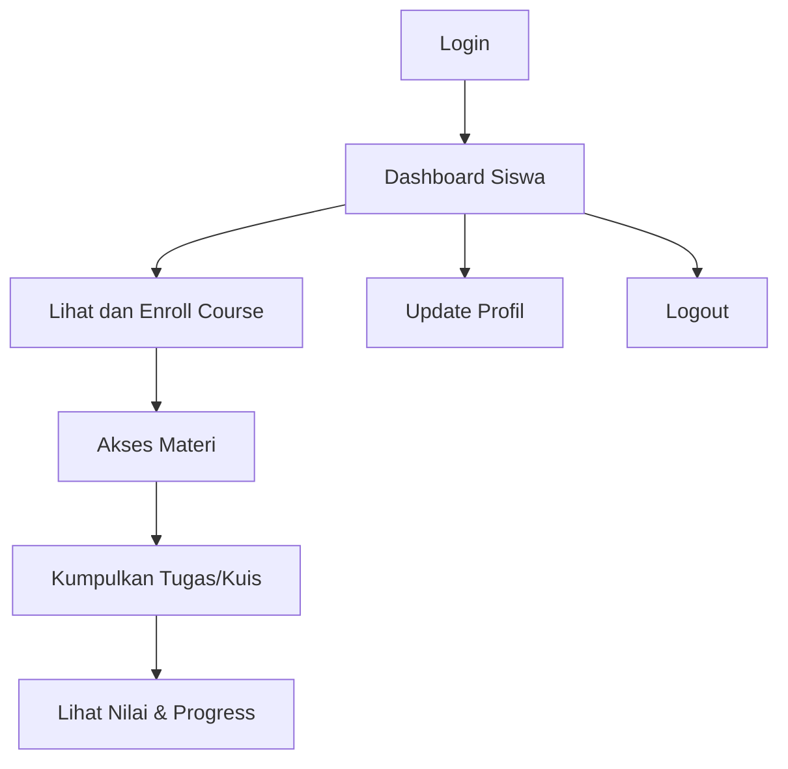

# Flowchart Alur Utama Masing-Masing Role LMS

## 1. Admin

## 2. Mentor

## 3. Student

---

**Penjelasan Singkat:**
- **Admin:** Memiliki akses penuh untuk mengatur user, role, branding platform, dan monitoring seluruh aktivitas.
- **Mentor:** Berperan dalam membuat, mengelola materi/tugas, dan menilai tugas siswa pada course yang diampu.
- **Student:** Mengakses materi, mengerjakan tugas, melihat hasil penilaian, dan dapat enroll ke course yang tersedia.